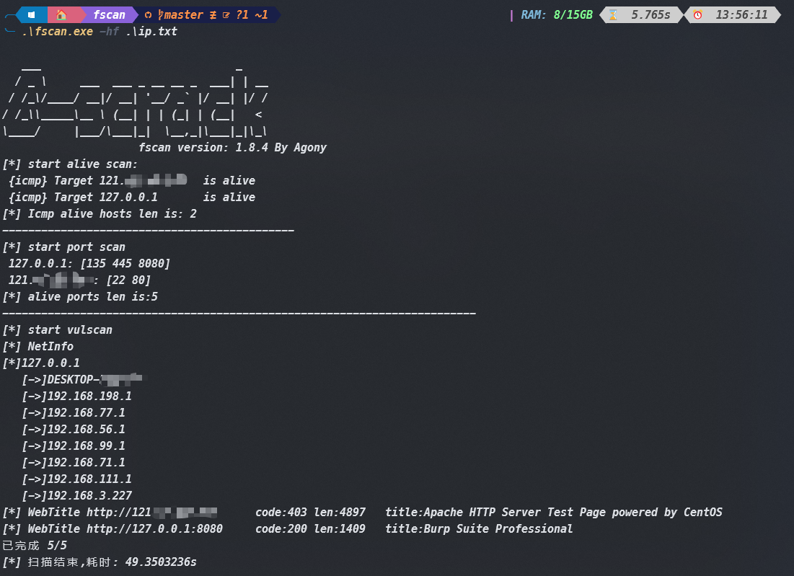

# 介绍

* 基于shadow1ng大佬的fscan魔改二开，并进行了一些免杀处理
* 因为go的1.21版本放弃了对Windows全版本的支持，建议用go 1.20的或者更低版本，博主使用 go1.20.1 版本
* 增加了2024HW期间海康威视、亿赛通、用友的部分POC
* 修改输出文件为rs.txt，重构了代码结构，更改了包名和函数名,添加了随机UA头文件
* 增加了zookeeper未授权扫描等poc，进一步优化了输出排版
* 实现了分离加载，使用go语言加载或者c语言加载都可以
* `修改了主机存活扫描按顺序输出以及优化了端口扫描输出`​
* `主机存活扫描输出乱序，可以根据ip大小排序输出`​
* 重命名整个项目

使用界面如下：



　

　　‍

# 编译

## 普通编译

```powershell
go build -ldflags="-w -s" -o fscan.exe -trimpath main.go
```

## 加载dll

　　生成dll文件：

```powershell
go build -ldflags="-w -s" -buildmode=c-shared -o fs.dll .\cmd\dll\main.go
```

　　​`这里可以选择 c和go加载器`​

　　生成go加载器：

```powershell
go build -o fs_go.exe .\cmd\loader\main.go
```

```python
//使用gradle混淆
gradle build -o fs.exe .\cmd\loader\main.go
```

　　生成C加载器：

```powershell
gcc -o fs_c.exe .\cmd\loader\main.c
```

　　如何使用dll：

* 将生成的dll文件和加载器放在同一目录，直接执行命令即可

# 使用

　　和原来的使用方法一致，跟以其一样的使用方法即可！

```
// 扫描单个ip
fscan.exe -h 127.0.0.1
// 批量扫描
fscan.exe -hf ip.txt
```

　　‍

# 去特征：

　　可以使用下面方法对fscan进行去特征

* 使用grable混淆
* upx压缩
* mangle
* 加壳

# **免责声明**

* 本工具仅能在取得足够合法授权的企业安全建设中使用，在使用本工具过程中，您应确保自己所有行为符合当地的法律法规。
* 如您在使用本工具的过程中存在任何非法行为，您将自行承担所有后果，本工具所有开发者和所有贡献者不承担任何法律及连带责任。
* 除非您已充分阅读、完全理解并接受本协议所有条款，否则，请您不要安装并使用本工具。
* 您的使用行为或者您以其他任何明示或者默示方式表示接受本协议的，即视为您已阅读并同意本协议的约束。
